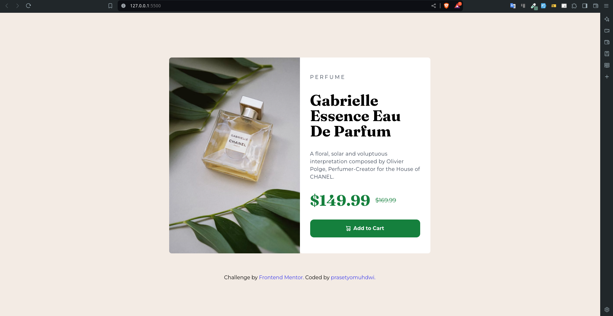
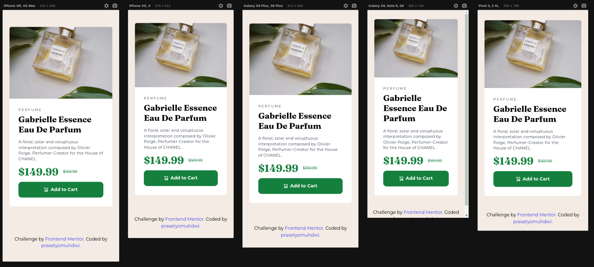

# Frontend Mentor - Product preview card component solution

This is a solution to the [Product preview card component challenge on Frontend Mentor](https://www.frontendmentor.io/challenges/product-preview-card-component-GO7UmttRfa). Frontend Mentor challenges help you improve your coding skills by building realistic projects. 

## Table of contents

- [Overview](#overview)
  - [The challenge](#the-challenge)
  - [Screenshot](#screenshot)
- [My process](#my-process)
  - [Built with](#built-with)
  - [Continued development](#continued-development)
  - [Useful resources](#useful-resources)
- [Author](#author)

**Note: Delete this note and update the table of contents based on what sections you keep.**

## Overview

### The challenge

Users should be able to:

- View the optimal layout depending on their device's screen size
- See hover and focus states for interactive elements

### Screenshot

## My process

### Built with

- Semantic HTML5 markup
- [Tailwindcss](https://tailwindcss.com/) - CSS framework
- custom properties in [tailwindcss.config.js](./tailwind.config.js)
- Mobile-first workflow

### Continued development

This project can be developed into a custom reusable component in the future. 

### Useful resources

- [tailwindcss](https://tailwindcss.com/) - This website helped me in referencing the classes in tailwindcss and how to customize them as per the brief.

## Author

- Frontend Mentor - [@prasetyomuhdwi](https://www.frontendmentor.io/profile/prasetyomuhdwi)
- Github - [@prasetyomuhdwi](https://www.github.com/prasetyomuhdwi)

